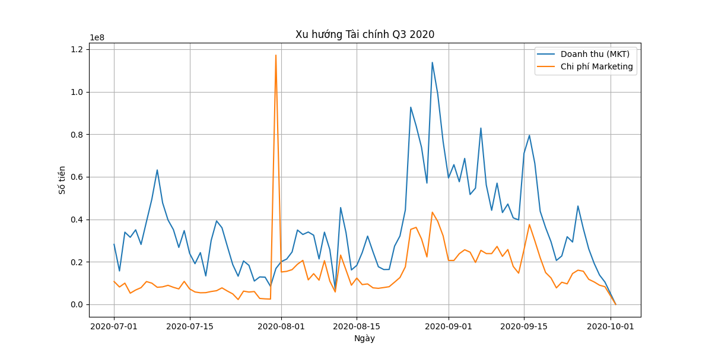
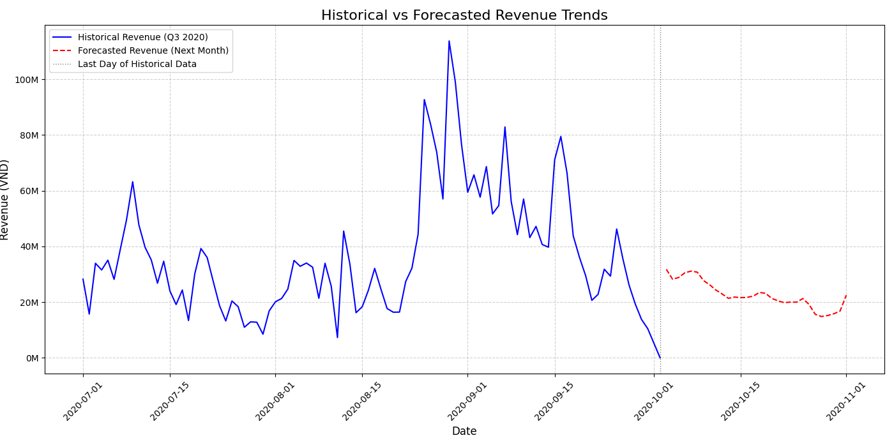

# Financial Analysis and Forecasting Report

**Data Source:** `Database-Q3_2020.xlsx` (Quarter 3, 2020)

## 1. Executive Summary

This report presents the results of the financial data analysis from Q3 2020 and the revenue forecast for the next 30 days (from 10/03/2020 to 11/01/2020).

Analysis shows that **Revenue** tends to fluctuate strongly by day, with several notable peaks. The forecasting model was built based on the **Random Forest Regressor** algorithm using time-series features (such as day of the week, day of the month, and lagged revenue values).

**Total Forecasted Revenue** for the next 30 days is **680,565,999 VND**.

## 2. Historical Data Analysis (Q3 2020)

Data was aggregated from the **MKT** and **Sales** sheets to create a daily time series of **Marketing Costs** and **Revenue**.

### 2.1. Revenue and Cost Trends

The chart below illustrates the daily trends of Revenue (from the MKT sheet) and Marketing Costs in Quarter 3 of 2020.

**Comments:**
* **Revenue** (blue line) has large fluctuations, reaching its highest peak around late August and early September.
* **Marketing Costs** (orange line) tend to be more stable, but there are some days with sudden cost spikes (especially in early August), possibly related to large advertising campaigns.
* The relationship between Marketing Costs and Revenue is not entirely linear, indicating that other factors (such as campaign quality, day of the week, etc.) also have a significant impact.

## 3. Forecasting Model

### 3.1. Methodology

* **Objective:** Forecast daily **Revenue**.
* **Model:** **Random Forest Regressor**. This model was chosen for its ability to handle non-linear relationships well and its lack of requirement for time-series stationarity compared to traditional ARIMA models.
* **Features used:**
    * Time features: Day of the week, Day of the month, Month.
    * Lag features: Revenue from the 7 previous days (`revenue_lag_1` to `revenue_lag_7`).
    * Rolling mean: Average revenue of the 7 most recent days (`revenue_rolling_mean_7`).

### 3.2. Model Evaluation

The model was trained on 80% of the data and tested on the remaining 20%.

| Evaluation Metric | Value (VND) |
| :--- | :--- |
| **Mean Absolute Error (MAE)** | 12,226,622 |
| **Root Mean Squared Error (RMSE)** | 16,828,903 |

MAE is the mean absolute error, indicating the average deviation of the forecast from reality. With an MAE of approximately 12.2 million VND, the model has an acceptable level of accuracy for forecasting the overall trend.

## 4. Forecast Results

The forecast was performed for the next 30 days, starting from 10/03/2020.

### 4.1. Forecast Overview

| Metric | Value |
| :--- | :--- |
| **Forecast Period** | 10/03/2020 - 11/01/2020 |
| **Total Forecasted Revenue** | **680,565,999 VND** |
| **Average Forecasted Revenue/day** | 22,685,533 VND |

### 4.2. Detailed Forecast Trend

The chart below combines historical data and the forecast.

**Comments on the Forecast:**
* **Trend:** Forecasted revenue (red dashed line) shows a relatively stable trend for the coming month, fluctuating around the level of 20-30 million VND/day.
* **Comparison:** This forecasted revenue level is significantly lower than the peaks in Q3 (especially late August/early September), but higher than the troughs of the cycle. This may reflect a natural decline after a period of strong growth or the absence of factors driving large revenue in the lagged data.

## 5. Appendix: Detailed Forecast Data

Detailed daily forecast data has been saved in the attached **`finance_forecast_next_month.csv`** file.

| Date | Forecasted Revenue (VND) |
| :--- | :--- |
| 2020-10-03 | 31,787,690 |
| 2020-10-04 | 28,238,160 |
| 2020-10-05 | 28,847,960 |
| 2020-10-06 | 30,548,490 |
| 2020-10-07 | 31,140,220 |
| ... | ... |
| 2020-11-01 | 24,288,070 |

## 6. Recommendations

To improve the accuracy of the model in the future, it is necessary to consider:
1.  **Add Features:** Include more features related to **Marketing Costs** and **Paid Revenue 1** into the Revenue forecasting model, as they can be important explanatory variables.
2.  **In-depth Models:** Test more specialized time-series models such as Facebook's Prophet or recurrent neural network models (RNN/LSTM) if the historical data is longer.
3.  **Cause Analysis:** Investigate the causes of revenue peaks and sudden cost spikes to include these events in the model as exogenous variables.